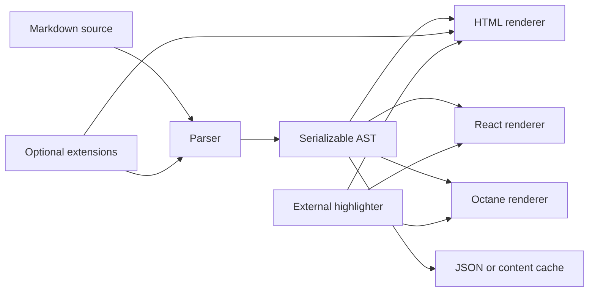

# Architecture

TanStack Markdown separates parsing, rendering, and optional docs behavior so each cost can be imported and measured independently.

## Package boundaries

- `parser.ts` owns document normalization, definitions, block parsing, and AST creation.
- `inline.ts` owns bounded inline parsing.
- `html.ts` owns escaping and string serialization.
- `react.ts` owns React element creation and component replacement.
- `octane.ts` owns Octane descriptor creation and component replacement.
- `types.ts` is the shared public contract.
- `extensions/*` contains opt-in docs behavior.

The parser never imports a renderer. The renderers never import a highlighter. The core never imports framework adapters or docs extensions.

## Design constraints

- no runtime dependencies in parser or HTML paths
- no asynchronous work in the default path
- no random or environment-specific IDs
- plain serializable AST nodes
- raw HTML disabled unless explicitly trusted
- renderer parity for core syntax
- bounded behavior for malformed input
- generated compatibility, performance, and bundle reports

## Why focused hooks?

The extension API handles the common need to add a docs block or derive metadata without paying for a general compiler pipeline. It intentionally does not implement async plugins, arbitrary virtual files, source maps, JSX evaluation, or cross-format compilation.

That boundary is the product: use a unified or MDX stack when those capabilities are central, and use TanStack Markdown when the controlled docs renderer is enough.

## Release gates

Every release preserves profile fixtures, established CommonMark matches, selected GFM examples, HTML/React/Octane parity, corpus determinism, resilience limits, bundle budgets, documentation coverage, typechecking, and production packaging.
